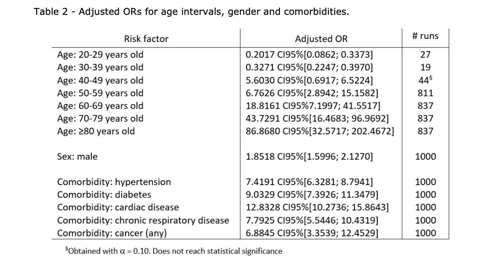

# comort
data/studies/sources related to mortality of covid19

## Articles

[COVID-19-related mortality by age groups in Europe: A meta-analysis](https://www.medrxiv.org/content/10.1101/2020.04.11.20061721v1.full.pdf+html)

[Population-Level Mortality Rates from Novel Coronavirus (COVID-19) in South Korea](https://www.medrxiv.org/content/10.1101/2020.03.23.20041814v1.full.pdf+html)

[Cardiovascular Diseases and COVID-19 Mortality and Intensive Care Unit Admission: A Systematic Review and Meta-analysis](https://www.medrxiv.org/content/10.1101/2020.04.12.20062869v1.full.pdf+html)

[COVID-19 clinical characteristics, and sex-specific risk of mortality: Systematic Review and Meta-analysis](https://www.medrxiv.org/content/10.1101/2020.03.24.20042903v1.full.pdf+html)

[Estimation of risk factors for COVID-19 mortality - preliminary results](https://www.medrxiv.org/content/10.1101/2020.02.24.20027268v1.full.pdf+html)

## Data

Epidemiological data from the COVID-19 outbreak, real-time case information
https://www.nature.com/articles/s41597-020-0448-0

https://github.com/beoutbreakprepared/nCoV2019
https://github.com/beoutbreakprepared/nCoV2019/tree/master/latest_data

## ourworldindata

Source: https://ourworldindata.org/covid-mortality-risk

Source: https://ourworldindata.org/grapher/covid-19-total-confirmed-cases-vs-total-confirmed-deaths?country=POL

Source: https://ourworldindata.org/grapher/case-fatality-rate-of-covid-19-vs-median-age?country=POL

Source: https://ourworldindata.org/grapher/covid-daily-deaths-trajectory-per-million?country=POL

## worldometers

Source: https://www.worldometers.info/coronavirus/coronavirus-age-sex-demographics/

## Newspapers

https://www.bbc.com/future/article/20200401-coronavirus-why-death-and-mortality-rates-differ

https://www.worldometers.info/coronavirus/

